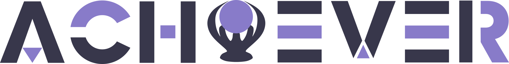

 

  

   
   

  

    Achiever is an open source playstation trophy platform with modern design with the goal to fit the needs of a passionate trophy hunter.
     
    <a href="https://DevTobias.github.io/achiever/"><strong>« Explore the docs »</strong></a>
     
     
    <a href="https://github.com/DevTobias/achiever/issues/newtemplate=bug_report.md">Report Bug</a>
    ·
    <a href="https://github.com/DevTobias/achiever/issues/newtemplate=feature_request.md">Request Feature</a>
  

  

  	
  

